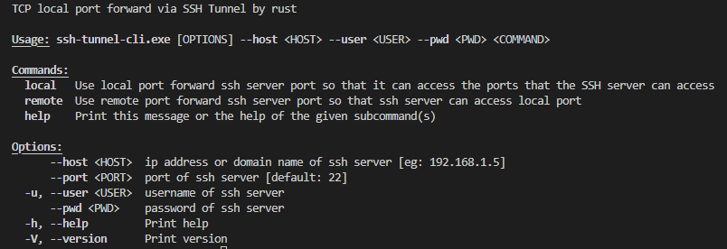
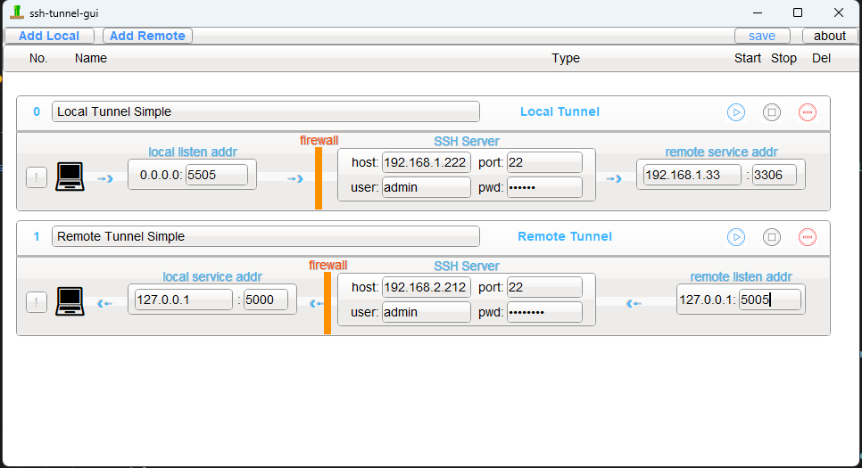

# ssh-tunnel-rs
this is a ssh tunnel forward tool by rust, contains cross platform GUI and CLI

### Dependency Framework
> if compile openssl error, try install cmake: https://cmake.org/download/ and https://strawberryperl.com/

- CLI: Rust 

- GUI: FLTK:https://github.com/fltk-rs/fltk-rs

### CLI


### GUI 


### How to use?

#### 1. Local port forward by password
```sh
ssh-tunnel-cli --host 192.168.5.45 --user someuser -a password --pwd somepwd local --local-port 3316 --remote-host 192.168.5.36 --remote-port 3306
```

#### 2. Remote port forward by password
```sh
ssh-tunnel-cli --host 192.168.5.45 --user someuser -a password --pwd somepwd remote --local-port 3316 --local-host 192.168.5.36 --remote-port 3306
```

#### 3. Local port forward by KeyPair
```sh
ssh-tunnel-cli --host 192.168.5.45 --user someuser -a key-pair --private_key /usr/yourname/private_k_file --local-port 3316 --remote-host 192.168.5.36 --remote-port 3306
```

#### 4. Remote port forward by KeyPair
```sh
ssh-tunnel-cli --host 192.168.5.45 --user someuser -a key-pair --private_key /usr/yourname/private_k_file remote --local-port 3316 --local-host 192.168.5.36 --remote-port 3306
```

### Roadmap
- [x] GUI for windows/winpe, linux, macos
- [x] cli for windows/winpe, linux, macos about local/remote tunnel
- [x] local ssh tunnel by user/password
- [x] remote ssh tunnel by user/password
- [x] support auth by ssh file
- [ ] support dynamic port forward
- [ ] support clearer status display
